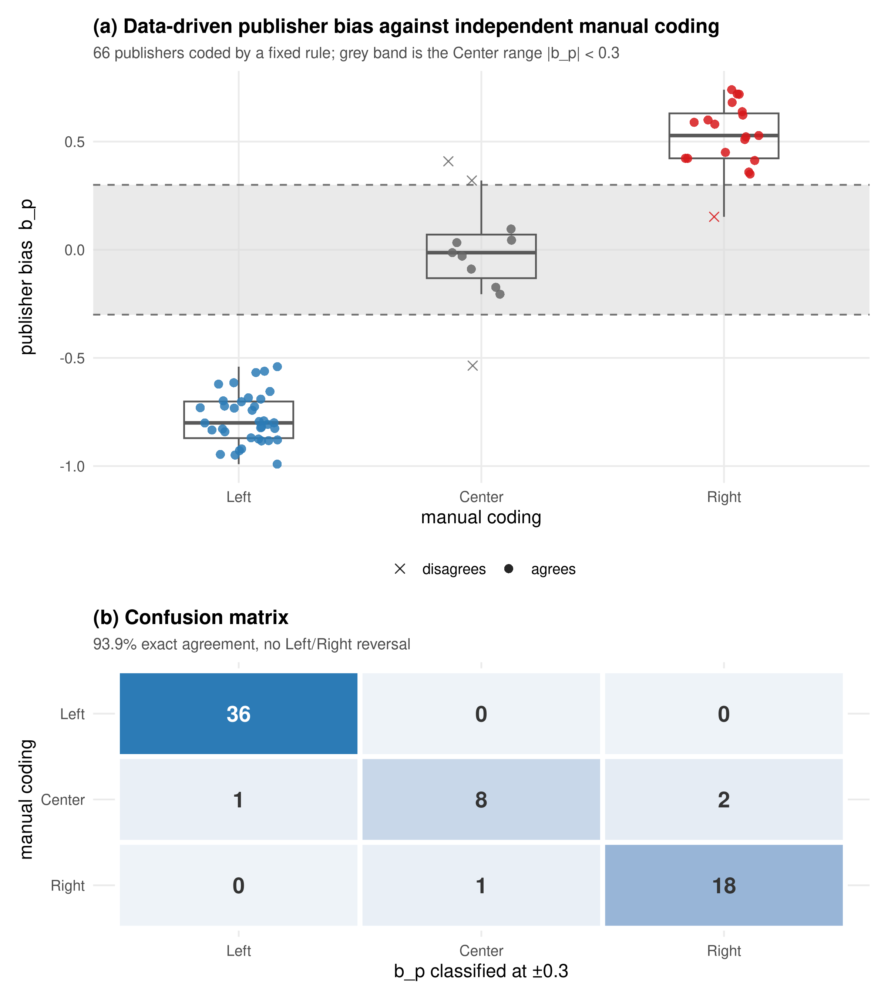
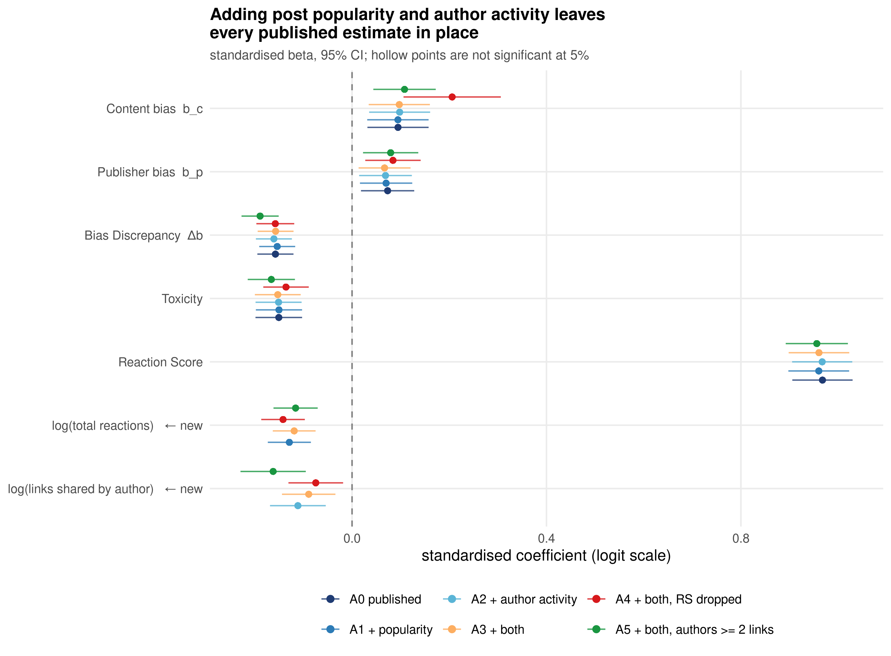
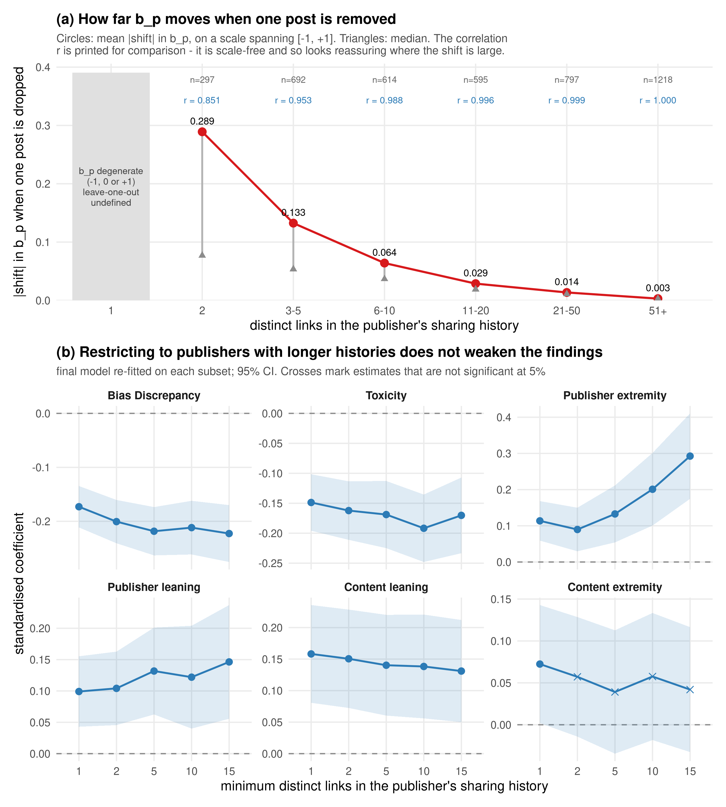
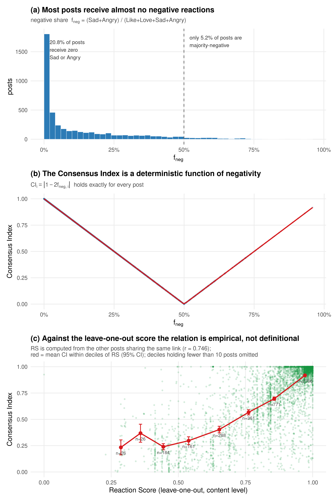
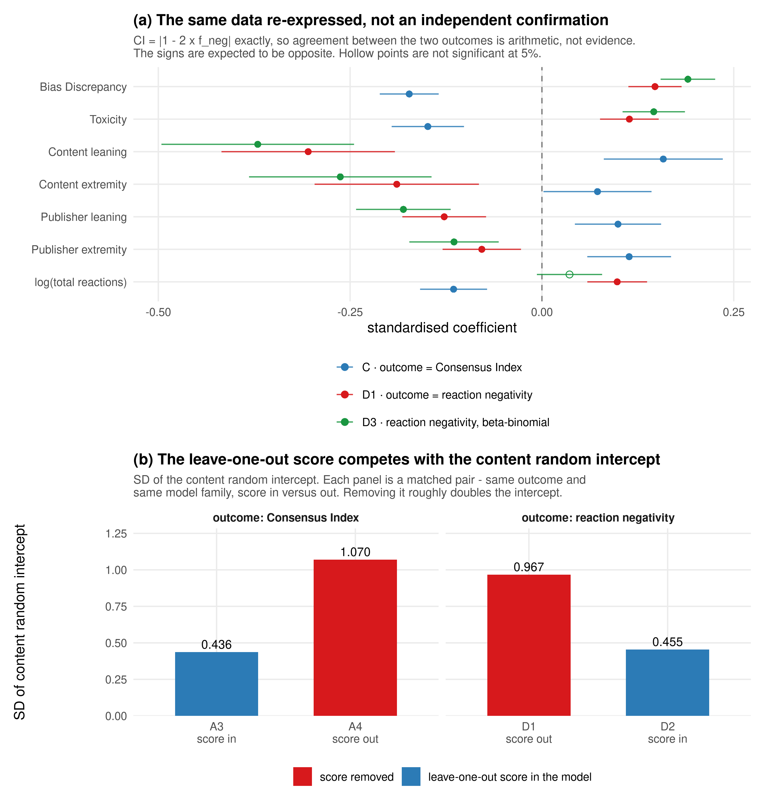
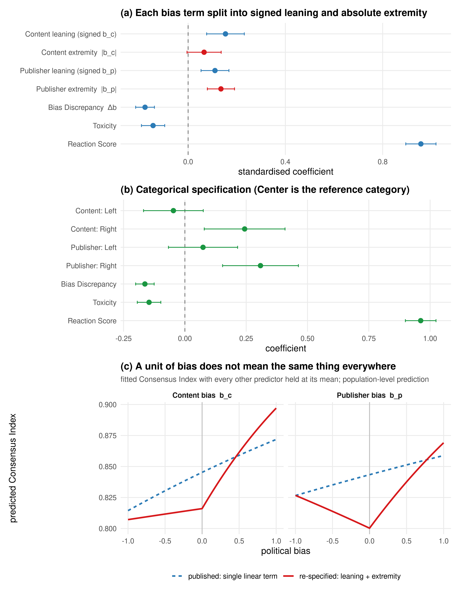
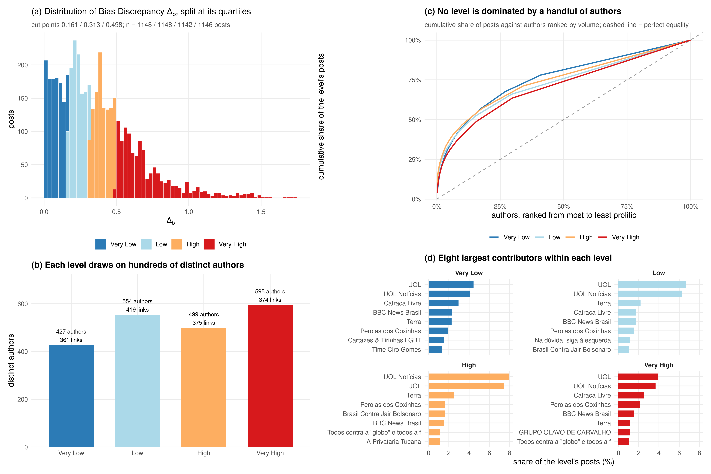
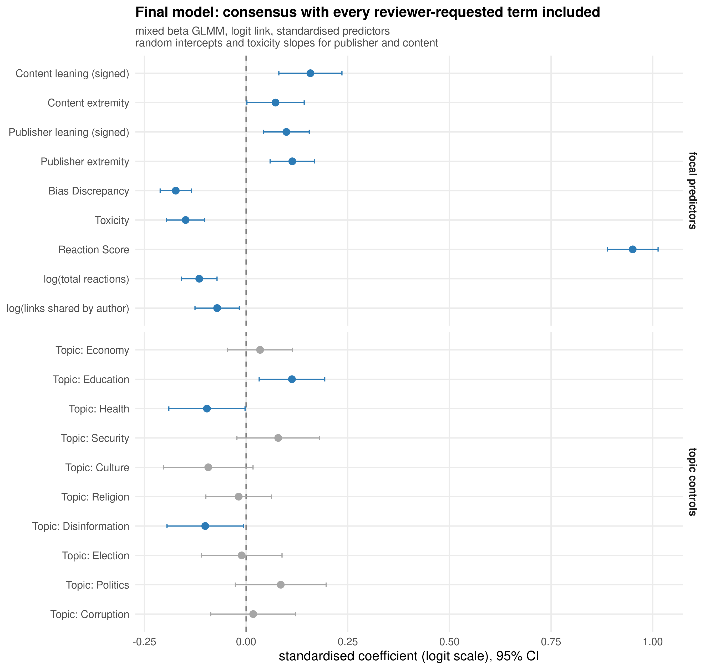

# Response to Reviewers

**Manuscript:** *Ideological discrepancy between publishers and news content is linked with audience consensus and toxicity on Facebook*

This document answers five specific requests raised in review. Each section restates the request, reports the analysis carried out to address it, and shows the evidence. Every number, table and figure in this document was produced by the scripts listed in the [Reproducibility](#reproducibility) appendix, running on the same data as the submitted manuscript.

Two conventions hold throughout:

- **Notation.** `b_c` is the political bias of the shared news content, `b_p` the political bias of the publisher, `Δb = |b_c − b_p|` the Bias Discrepancy, `CI` the Consensus Index, `RS` the Reaction Score, `Tox` toxicity.
- **Model family.** Every model below is the *same* estimator as the published one: a mixed beta GLMM with logit link, fitted in `glmmTMB`, with random intercepts and random toxicity slopes for both publisher and content, `(Tox | Publisher) + (Tox | Content)`. Continuous predictors are z-standardised, so coefficients are directly comparable across specifications. The outcome is the Smithson–Verkuilen transform of `CI`. All seventeen models reported here — nine main specifications, five re-fits on restricted subsets and three with an alternative outcome — converged with a positive-definite Hessian. The three in §4 use a different response variable, so their fit statistics are not comparable with the rest.

The analytical sample is unchanged: **4,584 posts, 1,243 publishers, 761 content items.** The pipeline was rebuilt from the raw sources for this response and reproduces the published dataset exactly — identical `b_c`, `b_p`, `Δb`, `Tox`, `RS` and `CI` values, row for row, and the same counts at every step of Table 1: 25,473 → 17,973 → 4,584.

Rebuilding it made two things about that ladder explicit which Table 1 does not currently show, and we propose to correct the table rather than leave them implicit:

- **Step 3 removes more than inaccessible text.** Five conditions remove rows there, not one. Of the 7,500 posts dropped, 4,975 have no retrievable article text, 2,968 received no Like, Love, Sad or Angry at all (so `CI` is 0/0), 503 are the only post in the corpus sharing their link and a further 46 share their link only with posts that drew no valence-bearing reaction (in both cases the leave-one-out `RS` is undefined), and 37 carry no bias score for the link they share. A post can fail more than one condition, so these counts overlap and sum to more than 7,500; together they account for the 7,500 exactly. The analytical sample is therefore also conditioned on a post carrying at least one valence-bearing reaction and on its link carrying at least one *other* post that does — which is stricter than "shared at least twice". The last condition matters for §3.3 and §4.1, which are about exactly that content-level clustering, and we should state it in the Methods.
- **A fourth filter is folded into step 4.** Five domains are excluded by hand (`g1.globo.com`, `jota.info`, `epoca.globo.com`, and two live-coverage URLs at `band.uol.com.br` and `redetv.uol.com.br`). Applied to the step-3 frame the ≥ 50 reactions cut alone leaves 6,983 posts; the domain exclusion removes the other 2,399. Table 1 should list it as its own step.

Neither changes the analytical sample — it is the published one — but both belong in the paper.

Our baseline model **A0** is the published specification and reproduces it — `b_c` = +0.095, `b_p` = +0.073, `Δb` = −0.158, `Tox` = −0.151, `RS` = +0.968; marginal R² = 0.742, conditional R² = 0.978 — which establishes the comparison point for everything that follows. The pipeline checks this rather than asserting it: it refits the original analysis code unchanged on the submitted `data_final.csv` and reproduces A0 exactly (maximum absolute difference across all sixteen coefficients, 0.000), then compares both against the printed table.

Against the *printed* Table 3, thirteen of the sixteen rows agree exactly on the estimate and on both confidence bounds. Three do not, and because the original code returns the A0 column, these are errors in the printed table rather than reproduction failures. We report them here and propose to correct them:

| Row | As printed | Should read | Why we are confident |
|---|---|---|---|
| `RS` | 0.966 [0.904, 1.029] | **0.968 [0.906, 1.030]** | The printed row is internally consistent, so this one is a slightly different fit rather than a transcription slip. `RS` is an order of magnitude larger than any other coefficient, so optimiser tolerance shows in its third decimal first. |
| `tCorruption` | +0.002 | **−0.002** | The printed interval [−0.106, +0.102] is already the correct one and is centred on −0.002. Only the sign of the estimate is wrong. |
| `tPolitics` | CI [+0.009, +0.213] | **[−0.009, +0.213]** | As printed the interval excludes zero while the same row reports *p* = 0.072. Both cannot hold. |

None of the three is statistically significant or load-bearing, and none changes a conclusion. We report them because a reader re-running the model will meet them, and the full cell-by-cell comparison is in `rebuttal/results/published_table3_check.csv`.

---

## 1. R1.5 — What Bias Discrepancy measures, and a direct validation of publisher bias

> **Reviewer:** *[…] what you measure with bias discrepancy is more how far the usual type of news shared is from the average type being shared for a particular publisher. I was wondering what this discrepancy really means? The surprise factor? Attention seeking? […] the obvious alternative to measure the political leaning would be to categorize the different publishers directly. If this is not feasible for the number of users, I would think that at least for some political figures (where the political leaning should be clear) this could be assessed easily as a check.*

### 1.1 The reviewer's reading of the measure is accurate

`b_p` is estimated from a publisher's own history of sharing ideologically labelled links, and `Δb = |b_c − b_p|` then compares one shared item against that history. The reviewer is right that this is a **within-publisher deviation measure**: it asks how far a particular item sits from what this publisher usually circulates, not how far the item sits from some externally defined position of the publisher.

We regard this as a feature to be stated plainly rather than a flaw, and we will re-frame the construct accordingly. `Δb` is an operationalisation of **departure from a publisher's own established sharing repertoire** — an off-repertoire share. The mechanisms the reviewer names are the right candidates for why such shares occur and why they attract divided reactions: the item is unexpected given the source, so it is read against the source's reputation rather than on its own terms, and audiences assembled around that reputation respond inconsistently. Framed this way, the negative `Δb` coefficient says that off-repertoire shares fragment the audience that the repertoire assembled, which is precisely the selective-exposure prediction. The revised Methods will say this explicitly instead of letting "ideological discrepancy" imply an external benchmark.

Two properties of the measure support treating it as substantive rather than circular. First, `b_p` is estimated over the publisher's *full* sharing history (mean 7.3 links, up to 288), so a single item moves it very little for active publishers. Second, `Δb` has a VIF of 1.02–1.14 in every specification, so it is not simply a repackaging of `b_c` and `b_p`.

### 1.2 Direct validation against manual coding

Rather than hand-pick a few convenient cases, we coded an entire frame exhaustively under a protocol fixed in advance.

**Frame.** All 117 publishers in the analytical sample with ≥ 15 links in their sharing history — the publishers for whom `b_p` is estimated from enough data to be meaningful. Every page in the frame was coded; none was dropped after its score was seen.

**Protocol.** Labels are assigned from the page's identity, never from its score:

- **Tier 1 — nominal.** The page title names a political actor (politician, party, organised movement) or an established media organisation. Politicians, parties and movements are coded by their documented position in the Brazilian party system; media organisations by their documented editorial line.
- **Tier 2 — avowed.** The page title contains an explicit ideological self-declaration without naming an actor ("Esquerda", "Conservador", "Direita", "Patriotas", "Intervenção Militar").
- **Not coded.** Everything else: regional and community pages, universities, hobby and entertainment pages, and ambiguous titles.

The coding is implemented in `rebuttal/scripts/02_publisher_labels.py` and is fully reproducible. It is not, however, free of discretion, and we would rather state that than overclaim: politicians, parties and movements are matched by regular expression, but **media organisations are a hand-assembled list of twenty outlets, one editorial-line judgement each, consulted before any rule**. That list is also the weakest part of the validation — see the per-tier agreement in §1.3 — so we report it separately rather than folding it into a single headline figure.

One disambiguation is applied and documented: *"Movimento Brasil LIVRE E SOBERANO — Rede Internacional da Legalidade"* is a different organisation from the right-wing *Movimento Brasil Livre* (MBL) whose name it partially contains, and is left uncoded as a name collision. The exclusion concerns the identity of the organisation, not its score. It is nevertheless load-bearing, and §1.3 reports the agreement statistics both with and without it.

This yields **66 coded publishers** (36 Left, 11 Center, 19 Right) and 51 non-identifiable. Coded pages are then compared against `b_p` classified at the manuscript's own ±0.3 thresholds.

### 1.3 Results



| Statistic | Value |
|---|---|
| Exact three-way agreement | **62 / 66 = 93.9%** |
| Left↔Right sign reversals | **0** |
| Pearson r (manual ordinal, `b_p`) | **0.965** |
| Spearman ρ | 0.897 (p = 2.3 × 10⁻²⁴) |
| Kendall τ-b | 0.770 (p = 2.7 × 10⁻¹⁵) |
| Cohen's κ | 0.896 (linearly weighted 0.933) |

**Confusion matrix** (rows = manual coding, columns = `b_p` at ±0.3):

| | Left | Center | Right |
|---|---:|---:|---:|
| **Left** | 36 | 0 | 0 |
| **Center** | 1 | 8 | 2 |
| **Right** | 0 | 1 | 18 |

Mean `b_p` by manual label: Left −0.780 (sd 0.116), Center −0.013 (sd 0.255), Right +0.527 (sd 0.152). The three groups are cleanly ordered and well separated.

Agreement by tier: **Tier 1 actors 35/36 (97.2%)**, Tier 2 avowed **12/12 (100%)**, Tier 1 media 15/18 (83.3%). The two rule-based tiers are therefore near-exact, and all of the error sits in the hand-assembled media list flagged in §1.2. Restricted to the 55 publishers coded Left or Right, agreement is 54/55 (98.2%) and **100% are on the correct side of zero**.

**Sensitivity to the one hand exclusion.** The name collision above is the only discretionary *exclusion* in the protocol, and the headline "no sign reversal" depends on it, so we report both readings:

| | Coded | Exact agreement | Left↔Right reversals |
|---|---:|---:|---:|
| With the exclusion (reported above) | 66 | 62 / 66 = 93.9% | 0 |
| Without it — page coded by the rules alone | 67 | 62 / 67 = 92.5% | 1 |

Dropping the exclusion lets the page be matched as *Movimento Brasil Livre* and coded Right against its `b_p` of −0.833. We consider the exclusion correct on the merits — it is a different organisation — but the reader should see that agreement is 92.5–93.9% rather than only the upper figure, and that the zero-reversal claim rests on this one identification.

### 1.4 The four disagreements, and what they tell us

| Publisher | Manual | `b_p` | Assigned | Links |
|---|---|---:|---|---:|
| O Globo | Center | −0.536 | Left | 30 |
| Sergio Moro 🇧🇷 | Right | +0.152 | Center | 27 |
| iG | Center | +0.320 | Right | 41 |
| BBC News Brasil | Center | +0.409 | Right | 29 |

All four are boundary cases, and three of the four are mainstream or international general-interest outlets that we coded Center. This is an informative limitation rather than a failure, and we will report it as such: `b_p` measures the **audience-side** leaning of the links a page circulates, derived from Twitter retweet networks. A mainstream outlet that mostly circulates its own coverage inherits the leaning of whichever audience shares that coverage, which need not match its editorial self-description. Two of the three (iG at +0.320, BBC at +0.409) sit just past the ±0.3 cut, so the disagreement is a threshold effect rather than a substantive misplacement. The fourth case, a page supporting Sergio Moro, falls just inside the Center band at +0.152 — plausibly because Lava Jato coverage circulated across the ideological spectrum in this period.

The overall picture is unambiguous: **for partisan pages and political figures — the publishers that carry the ideological signal in this study — the measure is essentially exact, with no sign reversals in 55 cases. Its uncertainty is concentrated at the Center/partisan boundary for mainstream outlets.**

We could add the protocol, the agreement statistics, the confusion matrix and the full 117-page coded frame to the Appendix, together with the re-framing of `Δb` set out in §1.1 and a Limitations paragraph on mainstream outlets.

---

## 2. R2.7 (i) — Controlling for post popularity and author activity

> **Reviewer:** *I would like to see a regression model that controls for post popularity (i.e., the number of reactions to a post) and author activity (i.e., the total number of links shared by the author), as these two quantities seem confounded with reaction homogeneity […] and ideological discrepancy.*

### 2.1 One premise holds in direction, the other is reversed

Before adding the controls we checked whether the two quantities behave as the reviewer anticipates. One does, weakly; the other is reversed in sign.

| Proposed confounder | Reviewer's expectation | Observed | Direction |
|---|---|---|---|
| Post popularity → reaction homogeneity | wider audience ⇒ more heterogeneous reactions | Spearman(log total reactions, `CI`) = **−0.084** (p = 1.1 × 10⁻⁸) | as expected |
| Post popularity → negativity | — | Spearman(log total reactions, f_neg) = **+0.082** | — |
| Author activity → discrepancy | short history ⇒ mechanically low `Δb` | Spearman(log links shared, `Δb`) = **−0.071** (p = 1.6 × 10⁻⁶) | **reversed** |

The first premise holds in direction and is statistically detectable in a sample of this size, but it is not large. Median `CI` drifts from 0.941 in the least-popular decile of posts to 0.918 in the most-popular decile; the gradient is shallow and not strictly monotone across deciles (the full decile table is in `rebuttal/results/descriptives.txt`).

**The second premise is reversed in sign, and the artefact it points at runs the other way.** A negative Spearman means `Δb` *falls* as the sharing history grows: on this measure a short history goes with **higher** discrepancy, not with the mechanically low discrepancy the reviewer anticipates. The relation is also not monotone — mean `Δb` is 0.329 at one link, 0.430 at two, 0.401 at three to five, 0.350 at six to twenty and 0.346 above twenty — so the negative correlation is driven by the decline across publishers that do have a history, not by compression at the short end.

The concern is nevertheless real, and the mechanism is worth stating precisely. 364 of the 1,243 publishers (29.3%, contributing 371 posts or 8.1% of the sample) appear with a single link in their sharing history. For such a publisher the estimator does not return a discrepancy of zero: it returns `b_p ∈ {−1, 0, +1}` by construction. Among posts from single-link publishers, `|b_p| = 1` in **71.2%** of cases and `b_p = 0` in the remaining 28.8%. These publishers are therefore *pinned to the extremes of the bias scale*, and their mean `Δb` (0.329) is only slightly *below* the sample mean (0.360), not at zero. So the mechanism is degenerate estimation of `b_p`, not compressed `Δb`. Section 2.3 addresses it directly by re-estimating the model without them.

### 2.2 Specifications

| Model | Specification |
|---|---|
| **A0** | published specification (baseline) |
| **A1** | A0 + `log(total reactions)` |
| **A2** | A0 + `log(links shared by author)` |
| **A3** | A0 + both controls |
| **A4** | A3 with `RS` removed (see §3.4) |
| **A5** | A3 re-estimated on publishers with ≥ 2 links in their history (n = 4,213) |

`total reactions` counts all eight Facebook reaction types on the focal post; `links shared by author` counts the distinct links in the publisher's full sharing history — the same history from which `b_p` is estimated, which is precisely the quantity the reviewer identifies.

### 2.3 The published estimates do not move



**Table 2.1 — Standardised coefficients across control specifications.** Significance: \*\*\* p < 0.001, \*\* p < 0.01, \* p < 0.05.

| Term | A0 (published) | A1 + popularity | A2 + activity | A3 + both | A4 (no RS) | A5 (≥2 links) |
|---|---|---|---|---|---|---|
| `b_c` | +0.095\*\* | +0.094\*\* | +0.098\*\* | +0.097\*\* | +0.206\*\*\* | +0.108\*\*\* |
| `b_p` | +0.073\*\* | +0.070\* | +0.069\* | +0.067\* | +0.084\*\* | +0.079\*\* |
| `Δb` | −0.158\*\*\* | −0.154\*\*\* | −0.161\*\*\* | −0.157\*\*\* | −0.158\*\*\* | −0.189\*\*\* |
| `Tox` | −0.151\*\*\* | −0.150\*\*\* | −0.151\*\*\* | −0.153\*\*\* | −0.136\*\*\* | −0.166\*\*\* |
| `RS` | +0.968\*\*\* | +0.960\*\*\* | +0.967\*\*\* | +0.961\*\*\* | — | +0.956\*\*\* |
| `log(total reactions)` | — | −0.129\*\*\* | — | −0.119\*\*\* | −0.142\*\*\* | −0.116\*\*\* |
| `log(author links)` | — | — | −0.111\*\*\* | −0.089\*\* | −0.075\*\* | −0.162\*\*\* |
| marginal R² | 0.742 | 0.751 | 0.752 | 0.760 | 0.121 | 0.758 † |
| conditional R² | 0.978 | 0.977 | 0.977 | 0.977 | 0.978 | 0.978 † |
| AIC | −14989.3 | −15018.3 | −15001.1 | −15026.1 | −14597.2 | −13739.4 † |
| n (posts) | 4,584 | 4,584 | 4,584 | 4,584 | 4,584 | **4,213** |

† A5 is fitted on 371 fewer posts, so its fit statistics are **not** comparable with the other five columns. AIC and log-likelihood scale with the number of observations, and essentially all of the −13739.4 against −15026.1 gap is the smaller sample, not a worse fit. Only the coefficient rows may be read across all six columns.

Both new controls are significant, negative, and of a size worth reporting: more popular posts and more prolific authors both attract measurably less consensus. This is a substantive finding in its own right and we will report it.

What matters for the manuscript's claims is that **including them changes essentially nothing**:

| Term | A0 | A3 | absolute change | relative change |
|---|---|---|---|---|
| `b_c` | +0.0946 | +0.0972 | +0.0026 | +2.8% |
| `b_p` | +0.0732 | +0.0668 | −0.0063 | −8.6% |
| `Δb` | −0.1577 | −0.1573 | +0.0004 | **+0.2%** |
| `Tox` | −0.1507 | −0.1528 | −0.0021 | −1.4% |
| `RS` | +0.9678 | +0.9606 | −0.0072 | −0.7% |

The Bias Discrepancy coefficient — the manuscript's central ideological result — moves by two parts in a thousand. No coefficient changes sign and none crosses p = 0.05; the only movement across a conventional threshold is `b_p`, which goes from p = 0.009 in A0 to p = 0.014 in A3 and so is printed \*\* in the first column and \* in the rest. Collinearity is negligible: in A3 every focal VIF lies between 1.01 and 1.36.

In effect-size terms, holding all other predictors at their means (predicted `CI` = 0.824 in A3), a one-SD increase produces (`rebuttal/results/model_marginal_effects.csv`):

| Predictor | 1 SD equals | Δ predicted `CI` |
|---|---|---|
| `Δb` | 0.27 bias units | **−2.4 pp** |
| `Tox` | 0.16 toxicity units | −2.3 pp |
| `RS` | 0.16 score units | +10.1 pp |
| `log(total reactions)` | a ≈ 4.9× larger audience | −1.8 pp |
| `log(author links)` | a ≈ 5.4× longer history | −1.3 pp |

The two new controls are real but second-order next to the affective and ideological terms.

**Model A5** removes the single-link publishers whose `b_p` is degenerate. Far from weakening the result, the discrepancy effect *strengthens* (`Δb` = −0.189 vs −0.157) and so does toxicity (−0.166 vs −0.153). The author-activity coefficient also roughly doubles (−0.162), confirming that activity carries genuine signal once the degenerate cases no longer dilute it. The manuscript's conclusions therefore do not rest on publishers with thin histories.

### 2.4 How reliable is `b_p` on a short history, and does its noise reach the results?

Model A5 answers the reviewer's concern at its worst point — publishers with a single shared link. The concern is really a continuum, though, so we measured it as one.

**Measuring the reliability of `b_p` directly.** If `b_p` is a stable property of a publisher, removing one of that publisher's posts should barely move it. We recomputed `b_p` leave-one-post-out for every post in the sample and compared it with the full-history score.

**Table 2.2 — Leave-one-post-out stability of `b_p`, by length of the sharing history.** `b_p` spans [−1, +1], so read the shift columns alongside the correlation: r is scale-free and looks reassuring exactly where the movement is largest.

| Distinct links in history | Posts | Mean \|shift\| | Median \|shift\| | r(full, leave-one-out) |
|---|---:|---:|---:|---:|
| **1** | **371** | **— degenerate —** | — | — |
| 2 | 297 | **0.289** | 0.077 | 0.851 |
| 3–5 | 692 | 0.133 | 0.054 | 0.953 |
| 6–10 | 614 | 0.064 | 0.037 | 0.988 |
| 11–20 | 595 | 0.029 | 0.019 | 0.996 |
| 21–50 | 797 | 0.014 | 0.011 | 0.999 |
| 51+ | 1,218 | 0.003 | 0.003 | 1.000 |

At two links the correlation is 0.851 — which sounds stable — while dropping a single post moves `b_p` by 0.289 on average, on a scale that runs from −1 to +1. The correlation is the wrong statistic to lead with here, and the two columns should be read together.

Overall r = 0.967 across the 4,230 posts for which the recomputation is defined, but that figure carries the same caveat. The script recomputes `b_p` from the raw corpus, so it asserts that its full-history value reproduces the `b_p` that actually entered the regressions before using it (maximum difference 0.000e+00). `b_p` is essentially exact above roughly ten links and genuinely noisy below five. The 371 posts from single-link publishers are shown in the table but carry no statistic, because for them `b_p` is degenerate rather than noisy: the estimator can only return −1, 0 or +1. For the 354 that posted their one link once the recomputation has nothing left to work with; for the 17 that posted it more than once the score cannot move, since only one category is present — a stability that is an artefact of the degeneracy, not evidence of reliability.

It matters how this is weighted. Publishers with one link are 29.3% of *publishers* but only 8.1% of *posts*; 25.6% of posts come from publishers with fewer than five links. The model weights by post, and the post-weighted median history is 14 links.

**Does the noise reach the estimates?** We re-fitted the final model on progressively cleaner subsets, keeping only publishers that shared at least *N* distinct links. (That is very nearly, but not exactly, the number of links `b_p` rests on: a few shared links carry no bias score and so contribute nothing to `b_p`. It bites once, at the ≥ 5 cut, where three publishers contributing 7 posts are admitted on four scored links rather than five.) If the findings were an artefact of noisy `b_p`, the coefficients should drift away as the threshold rises.



**Table 2.3 — Final model re-fitted by minimum sharing history.** Significance: \*\*\* p < 0.001, \*\* p < 0.01, \* p < 0.05.

| Term | ≥ 1 link | ≥ 2 | ≥ 5 | ≥ 10 | ≥ 15 |
|---|---|---|---|---|---|
| Content leaning | +0.158\*\*\* | +0.151\*\*\* | +0.140\*\*\* | +0.138\*\*\* | +0.131\*\* |
| Content extremity | +0.072\* | +0.057 | +0.039 | +0.058 | +0.042 |
| Publisher leaning | +0.099\*\*\* | +0.104\*\*\* | +0.132\*\*\* | +0.122\*\* | +0.146\*\* |
| Publisher extremity | +0.114\*\*\* | +0.090\*\* | +0.133\*\*\* | +0.201\*\*\* | +0.293\*\*\* |
| **Bias Discrepancy `Δb`** | **−0.173\*\*\*** | **−0.201\*\*\*** | **−0.218\*\*\*** | **−0.212\*\*\*** | **−0.223\*\*\*** |
| Toxicity | −0.149\*\*\* | −0.162\*\*\* | −0.169\*\*\* | −0.192\*\*\* | −0.170\*\*\* |
| Reaction Score | +0.951\*\*\* | +0.940\*\*\* | +0.975\*\*\* | +0.947\*\*\* | +0.958\*\*\* |
| log(total reactions) | −0.115\*\*\* | −0.113\*\*\* | −0.094\*\*\* | −0.067\* | −0.058 |
| log(author links) | −0.071\* | −0.130\*\*\* | −0.114\*\* | −0.045 | +0.048 |
| Posts | 4,584 | 4,213 | 3,412 | 2,727 | 2,240 |
| Publishers | 1,243 | 879 | 418 | 204 | 117 |
| Marginal R² | 0.762 | 0.761 | 0.776 | 0.779 | 0.811 |

The answer runs the other way from the concern: nothing weakens. Bias Discrepancy is negative and significant at p < 0.001 in every subset, and its point estimate grows from −0.173 to −0.223 while the sample halves. Toxicity stays between −0.149 and −0.192, and publisher extremity rises from +0.114 to +0.293. Each subset is standardised on its own SD, so before reading anything into these shifts we checked all nine predictors for rescaling. Seven hold their scale to within 10% between the full sample and ≥ 15 links, `Δb` among them (its SD varies by at most 2.4% across the whole ladder), and for those the columns are comparable; `Δb` shows the same pattern in raw units (−0.643 → −0.810). Two do not, and their standardised coefficients must not be read across columns: **`log(author links)`**, whose SD falls **41%** because the subsets are defined by that very variable, and **`publisher leaning`**, whose SD falls 15%.

We are deliberately careful about how much to read into the *size* of these shifts, for two reasons.

**The confidence intervals mostly overlap.** For `Δb` the full-sample estimate (−0.173) lies just inside the ≥ 15 interval [−0.275, −0.170]; for toxicity the two intervals contain each other's point estimates outright. Only publisher extremity separates cleanly (+0.114 [+0.059, +0.168] vs +0.293 [+0.175, +0.411]). The defensible claim is therefore **stability**, not a measured increase.

**The threshold does not isolate measurement error — it also changes the population.** Requiring a longer sharing history selects larger, more institutional publishers:

**Table 2.4 — What the sample looks like at each threshold.** Publisher attributes are reported both per post and per distinct publisher, because the two weightings disagree. `subscriberCount` is a per-post snapshot and is not constant within a publisher, so the per-publisher column takes each publisher's median rather than an arbitrary one of its posts.

| Threshold | Posts | Publishers | Median reactions | Mean toxicity | Subscribers /post | Subscribers /publisher | Centrist /post | Centrist /publisher |
|---|---:|---:|---:|---:|---:|---:|---:|---:|
| ≥ 1 link | 4,584 | 1,243 | 290 | 0.126 | 149,672 | 45,077 | 23.3% | 19.5% |
| ≥ 2 | 4,213 | 879 | 313 | 0.126 | 164,399 | 47,877 | 22.9% | 15.6% |
| ≥ 5 | 3,412 | 418 | 398.5 | 0.122 | 199,097 | 55,274 | 25.1% | 15.1% |
| ≥ 10 | 2,727 | 204 | 511 | 0.111 | 309,585 | 78,230 | 28.2% | 12.7% |
| ≥ 15 | 2,240 | 117 | 611 | 0.106 | 413,297 | 78,168 | 32.8% | 15.4% |

Between the full sample and ≥ 15 links the median post more than doubles in reactions (290 → 611) and mean toxicity falls 16%. Publisher size grows on either weighting, though by different amounts: 2.8× per post, 1.7× per distinct publisher.

The centrist share is the one quantity where the weighting decides the direction, and it is worth stating plainly. Counted per post it **rises** (23.3% → 32.8%); counted per distinct publisher it **falls** (19.5% → 15.4%). Both are true of the same data: the threshold keeps a handful of very high-volume centrist outlets whose posts dominate the post-weighted share, while removing proportionally more centrist publishers than partisan ones. Only the per-publisher figure describes publishers; the per-post figure describes the fitting sample.

Either way the composition moves, which is the point here. Consistently, terms with no dependence on `b_p` at all also move — `log(total reactions)` halves (−0.115 → −0.058) and content leaning drifts down (+0.158 → +0.131). A pure correction for noise in `b_p` could not do that. So the restricted fits describe *active, institutional publishers*, not the same population measured better.

This is why we keep the full sample as the reported specification rather than adopting a threshold. Truncating on a covariate trades measurement error for selection on that covariate, and the quantity the paper is about — how publishers in general behave — is the unrestricted one. The one restriction we do adopt, model A5, rests on a definitional rather than a statistical argument: with a single shared link `b_p` is not a noisy estimate but a degenerate label in {−1, 0, +1}, and dropping those posts costs 8.1% of the sample while leaving its composition essentially unchanged (median reactions 290 → 313). Readers who prefer a stricter cut can read it off Table 2.3; no conclusion in the paper turns on which column they choose.

Two terms behave differently and we report both.

- **Content extremity does not survive.** It reaches p < 0.05 only in the full sample, and only barely (95% CI +0.002 to +0.143), and is non-significant at every threshold (p = 0.12, 0.30, 0.14, 0.27). We treat it as unsupported; the leaning/extremity split of §5 is carried by the *publisher* side, not the content side.
- **log(author links) is not interpretable across these columns.** Its standardised coefficient runs −0.071\* → −0.130\*\*\* → −0.114\*\* → −0.045 → +0.048, but the subsets are defined by this variable and its SD falls 41% across them, so the apparent sign change is a rescaling effect. In raw units the trajectory is −0.042, −0.085, −0.088, −0.040, +0.048 (the `raw_estimate` column of `threshold_models.csv`) — still not a stable estimate, which is the honest conclusion: once the sample is restricted on sharing history, there is too little variance left in it to estimate its effect.

### 2.5 What we could add to the manuscript

Model A3 becomes the reported specification, with A0 retained in the Appendix so readers can see that nothing moved; A5 is reported as a robustness check; and a paragraph is added to the Limitations noting the degenerate behaviour of `b_p` for single-link publishers.

Tables 2.2, 2.3 and 2.4 go into the Appendix as a reliability analysis of `b_p`, reported as a stability result: every conclusion holds across the ladder, and the estimates do not weaken as `b_p` becomes more reliable. We state explicitly that we retain the full sample rather than a threshold, and why. The Limitations paragraph is extended from "single-link publishers" to the graded statement the data support — `b_p` is unreliable below about five shared links, which covers 25.6% of posts, and essentially exact above ten.

---

## 3. R2.7 (ii) — Reaction composition, and how much of the negativity–heterogeneity link is mechanical

> **Reviewer:** *I wonder how much of the correlation between reaction negativity and heterogeneity (line 425) is simply explained by the reaction mechanism on Facebook—i.e., with the default reaction ("like") being positive, most posts get all-positive reactions (is that the case? it would be nice to see some statistics in the Appendix), so getting negative reactions naturally means getting mixed reactions.*

It is partly correct. We separate the part that is definitional from the part that is not.

### 3.1 Descriptive statistics on reaction composition



**Table 3.1 — Every reaction cast in the analytical sample (n = 7,815,629).**

| Reaction | Count | Share |
|---|---:|---:|
| Like | 5,064,293 | **64.80%** |
| Haha | 1,324,782 | 16.95% |
| Love | 563,639 | 7.21% |
| Angry | 428,844 | 5.49% |
| Sad | 359,031 | 4.59% |
| Wow | 75,025 | 0.96% |
| Care | 15 | 0.00% |
| Thankful | 0 | 0.00% |

The default reaction alone accounts for **64.8%** of everything users clicked. The four valence-bearing reactions used by our metrics (Like, Love, Sad, Angry) cover 82.1% of all reactions. Like is the modal reaction on **89.9%** of posts, and the median post draws 73.2% of its reactions as Likes.

**Table 3.2 — Per-post composition over the valence set (Like + Love vs. Sad + Angry), N = 4,584.**

| Composition | Posts | Share |
|---|---:|---:|
| All-positive (zero Sad and Angry) | 953 | **20.79%** |
| Mixed (both signs present) | 3,631 | 79.21% |
| All-negative (zero Like and Love) | 0 | 0.00% |
| Contains ≥ 1 negative reaction | 3,631 | 79.21% |
| Majority-negative (f_neg > 0.50) | 237 | 5.17% |

Writing f_neg = (Sad + Angry) / (Like + Love + Sad + Angry) for the post's own negative share:

| Threshold | Posts at or below | Share |
|---|---:|---:|
| f_neg = 0 | 953 | 20.79% |
| f_neg ≤ 0.01 | 1,474 | 32.16% |
| f_neg ≤ 0.05 | 2,396 | 52.27% |
| f_neg ≤ 0.10 | 2,822 | 61.56% |
| f_neg ≤ 0.25 | 3,651 | 79.65% |
| f_neg ≤ 0.50 | 4,347 | 94.83% |

Mean f_neg = 0.130, median 0.043. So the reviewer's factual premise is confirmed with one correction: strictly all-positive posts are a large minority (20.8%) rather than a majority, but the distribution is heavily concentrated near zero — the median post is 95.7% positive, and 94.8% of posts are majority-positive. No post in the sample received only negative reactions.

### 3.2 At the post level, negativity and heterogeneity are the same quantity

We can be precise rather than approximate about this. By definition,

```
CI_i = |n⁺ᵢ − n⁻ᵢ| / (n⁺ᵢ + n⁻ᵢ)  =  |1 − 2·f_neg,i|
```

This is an identity, and it holds in the data to machine precision (maximum absolute deviation 1.1 × 10⁻¹⁶ across all 4,584 posts). Panel (b) of the figure shows the result: every point lies exactly on the V. Since only 5.2% of posts fall beyond f_neg = 0.5, for 94.8% of the sample the identity collapses to the straight line `CI = 1 − 2·f_neg`, and Spearman(`CI`, f_neg) = **−0.995**.

**We therefore agree with the reviewer on this point: a post's own reaction negativity and its own reaction heterogeneity are one measurement, not two.** Any statement of the form "posts with more negative reactions have lower consensus" is arithmetic, not evidence, and the manuscript should not make it.

### 3.3 The predictor in the model is not the post's own negativity

The model does not regress `CI` on the focal post's negativity. It regresses `CI` on the **Reaction Score**, which is computed by construction from the *other* posts sharing the same link, with the focal post excluded. The identity above does not apply, and the association is empirical:

| Quantity | Value |
|---|---|
| Pearson(`CI`, `RS`) | **0.746** |
| Pearson(f_neg own post, f_neg other posts, same link) | 0.782 |
| Spearman(f_neg own, f_neg others) | 0.719 |
| ICC of f_neg across content items (one-way ANOVA) | **0.701** |

The last row is the mechanism. **70.1% of the variance in how negatively an audience reacts is attributable to which news item is being shared**, and that is exactly what `RS` captures. The `CI`–`RS` association is bounded by, and essentially equal to, this content-level reproducibility of reaction mix. So the finding at line 425 is not a definitional artefact — but it is also not a claim about negativity *causing* disagreement. It is the statement that news items have characteristic affective profiles, and a publisher sharing an item that draws anger elsewhere will draw a divided response too.

**One qualification, which we should state rather than let a reader discover.** `RS` leaves out the focal *post*, not the focal *publisher*. Where a page shared the same link more than once, that page's own other posts remain inside its `RS`:

| | Posts | Share |
|---|---:|---:|
| (content, publisher) pairs contributing more than one post to an `RS` | 403 | — |
| Posts whose `RS` includes another post by the **same** publisher | 720 | 15.71% |
| Posts whose `RS` comes **entirely** from the same publisher | 60 | 1.31% |

These are counted on the frame `RS` is actually built over — the 25,473 posts preceding the listwise deletion of step 3 — and not on the 4,584 that survive it, because a post's `RS` can include same-publisher posts that never entered the analytical sample. Measured inside the analytical sample the same quantities read 549 (11.98%) and 97 (2.12%), which understates the general case and overstates the worst one.

So "a different audience" is exact for 84.3% of the sample and only partial for the rest; for 60 posts `RS` is that page's own audience reacting to the same link. The argument of this section therefore holds in full for the large majority of posts and is weakened, not eliminated, for the remainder — the identity of §3.2 still does not apply, because even those rows exclude the focal post's own reactions. A leave-one-*publisher*-out score would settle it cleanly and we can compute one if the reviewer prefers.

Two further checks support the interpretation:

- Restricting to the 3,631 mixed posts, Pearson(`CI`, `RS`) = 0.733 and Spearman = 0.746 — essentially unchanged. The all-positive posts have `CI` = 1 identically and contribute no variance to the slope, so the association is estimated entirely on posts that actually vary.
- Panel (c) of the figure plots mean `CI` within deciles of `RS` rather than a smoother, because the low-`RS` end is very thinly sampled: only 53 posts (1.2%) have `RS` < 0.4 and a single post has `RS` < 0.2. Across every bin holding more than 100 posts (`RS` ≥ 0.4, 98.8% of the sample) mean `CI` increases monotonically with `RS`, from 0.24 to 0.92; the three bins below 0.4 hold 1, 26 and 26 posts and are too noisy to order. (Bins are left-closed, `[lo, hi)`, in both the figure and this text — 170 posts have an `RS` falling exactly on a decile boundary, so the convention has to be the same on both sides or the counts disagree.) The manuscript's statement at line 425–426 is therefore supported: content drawing predominantly negative reactions elsewhere corresponds to divided responses, not to consensus around a negative evaluation. We will add the caveat that the strongly negative end of the `RS` scale is too sparsely populated in this corpus to test whether that pattern eventually reverses.

### 3.4 The ideological findings do not depend on `RS` at all

Model **A4** removes `RS` entirely. This is the strongest available test of whether the paper's conclusions are an artefact of the reaction mechanism.

| Term | A3 (with `RS`) | A4 (without `RS`) |
|---|---|---|
| `b_c` | +0.097\*\* | +0.206\*\*\* |
| `b_p` | +0.067\* | +0.084\*\* |
| `Δb` | −0.157\*\*\* | **−0.158\*\*\*** |
| `Tox` | −0.153\*\*\* | −0.136\*\*\* |
| `log(total reactions)` | −0.119\*\*\* | −0.142\*\*\* |
| `log(author links)` | −0.089\*\* | −0.075\*\* |
| marginal R² | 0.760 | 0.121 |
| conditional R² | 0.977 | 0.978 |

The Bias Discrepancy coefficient **moves by 0.0006, or 0.4%**, with and without `RS`; toxicity retains its sign, size and significance; content bias strengthens. What collapses is only the *marginal* R², from 0.760 to 0.121 — `RS` carries nearly all of the fixed-effect explanatory power, which is unsurprising given §3.3. Conditional R² is unaffected (0.978), because the content-level variance simply moves into the random effects where it belongs.

We should report this openly: **`RS` is by far the largest term in the model, and most of what it explains is content-level affective structure rather than an independent behavioural mechanism. The ideological results stand entirely on their own without it.**

### 3.5 What we could add to the manuscript

Tables 3.1 and 3.2 and the f_neg thresholds go into the Appendix as requested. The identity `CI = |1 − 2·f_neg|` is stated explicitly in the Methods, so that no reader mistakes it for an empirical finding. The passage at line 425–426 is rewritten to attribute the `CI`–`RS` association to the content-level reproducibility of reaction mix (ICC = 0.70) rather than to a behavioural mechanism, and to note that the strongly negative end of the `RS` scale is sparsely sampled. Model A4 is reported as a robustness check.

---

## 4. R2.8 — The Reaction Score, and reaction negativity as the outcome

> **Reviewer:** *The current calculation of "Reaction Score" feels a bit awkward. I understand that the authors are trying to capture the "inherent" emotional valence of the link by aggregating the emotional valence of all reactions across the platform, but I think this operationalization is rather debatable. To me, simply taking the reaction negativity of the target post as an outcome variable for the question "do cross-cutting posts elicit more negative reactions?" feels more sensible. I would also suggest renaming the variable to something more informative, such as "Reaction Positivity" or "Reaction Negativity".*

We agree with this comment, and the evidence below supports it more strongly than the reviewer puts it. We set out what we found and leave the choice of specification open at the end, because it is a decision about the paper's framing and not only about model fit.

### 4.1 `RS` is largely a restatement of the content random intercept

`RS` is a **leave-one-out, content-level positivity score**: it aggregates reactions across the *other* posts sharing the same link. Its ICC across content items is **0.974** — it is very nearly one constant per link.

The model, however, already contains a random intercept for content, `(1 | Content)`, whose job is exactly to absorb content-level variation. The two therefore compete for the same variance, and removing `RS` shows it directly:

**Table 4.1 — What happens to the content random intercept when `RS` is removed.**

| Model | Outcome | `RS` in model | SD of content intercept | Marginal R² | Conditional R² |
|---|---|---|---:|---:|---:|
| A3 | Consensus Index | yes | 0.436 | 0.760 | 0.977 |
| A4 | Consensus Index | no | **1.070** | 0.121 | **0.978** |
| D2 | reaction negativity | yes | 0.455 | 0.395 | 0.556 |
| D1 | reaction negativity | no | **0.967** | 0.088 | **0.603** |
| D3 | reaction negativity (counts) | no | 1.085 | 0.110 | 0.692 |

Removing `RS` roughly **doubles** the content random intercept on both outcomes and in two model families, and the conditional R² does not fall when it goes: 0.977 → 0.978 on consensus, 0.556 → **0.603** on negativity. What collapses is only the marginal R² (0.760 → 0.121 and 0.395 → 0.088), which is the one figure the move can affect. The variance is not lost; it is relabelled from a fixed effect to a random one.

This reframes the published claim that `RS` is "the strongest predictor" with β = 0.966 (0.968 once the erratum above is applied) and most of the marginal R². Marginal R² counts fixed effects only, so moving content-level variance across the fixed/random boundary inflates it without the model accounting for anything more. `RS` is not measuring an independent mechanism; it is a fixed-effect parameterisation of "which link is this", which the design already handles.

### 4.2 Reaction negativity as the outcome

The reviewer's alternative works, and answers RQ1 directly. We fitted three specifications with the same right-hand side and random-effect structure as the final model:

- **D1** — beta GLMM on the post's own negative share, Smithson–Verkuilen transformed, directly comparable to the published model
- **D2** — D1 plus `RS`, to test whether the constructed score still carries anything
- **D3** — beta-binomial GLMM on the raw counts `cbind(n⁻, n⁺)`, which handles the 20.8% mass at zero and weights posts by reaction volume



**Table 4.2 — The same right-hand side, read off either outcome.** Significance: \*\*\* p < 0.001, \*\* p < 0.01, \* p < 0.05.

| Term | C · Consensus Index | D1 · negativity | D2 · negativity + `RS` | D3 · negativity, counts |
|---|---|---|---|---|
| Content leaning | +0.158\*\*\* | −0.305\*\*\* | −0.145\*\*\* | −0.370\*\*\* |
| Content extremity | +0.072\* | −0.189\*\*\* | −0.088\* | −0.263\*\*\* |
| Publisher leaning | +0.099\*\*\* | −0.127\*\*\* | −0.118\*\*\* | −0.181\*\*\* |
| Publisher extremity | +0.114\*\*\* | −0.078\*\* | −0.079\*\* | −0.115\*\*\* |
| **Bias Discrepancy `Δb`** | **−0.173\*\*\*** | **+0.147\*\*\*** | **+0.142\*\*\*** | **+0.190\*\*\*** |
| Toxicity | −0.149\*\*\* | +0.114\*\*\* | +0.135\*\*\* | +0.146\*\*\* |
| `RS` | +0.951\*\*\* | — | −0.757\*\*\* | — |
| log(total reactions) | −0.115\*\*\* | +0.098\*\*\* | +0.085\*\*\* | +0.036 |
| log(author links) | −0.071\* | +0.043 | +0.053\* | +0.047 |

Consensus is high when reactions agree; negativity is high when they are hostile. The signs are therefore *expected* to be opposite, and they are, for every term. The reviewer's question gets a direct answer: **cross-cutting posts do elicit more negative reactions** (`Δb` = +0.147, p = 8 × 10⁻¹⁷; +0.190 on counts).

Two observations that matter for the choice of outcome.

- **Content extremity reads differently on the two outcomes.** It is marginal on consensus (+0.072, p = 0.044) and clear on negativity (−0.189, p = 5 × 10⁻⁴; −0.263 on counts). We do **not** read this as evidence that one outcome is more powerful than the other: the two models have different response variables, so their p-values are no more comparable than their AICs. What we can say is that the folding in `CI` is a plausible mechanism for losing a signal the unfolded outcome retains (§4.3), and that a claim about content extremity is therefore specification-dependent and should not be made on the strength of either model alone.
- **`RS` survives as a predictor of negativity** (−0.757) but with the same caveat as above: adding it halves the content intercept (0.967 → 0.455) rather than explaining anything the design did not already capture.

Note that AIC is comparable only *within* an outcome (D2 improves on D1 by 314 AIC, which is this same absorption effect). It must not be compared between C and D1–D3, which have different response variables, and the same restriction applies to the R² of Table 4.1.

### 4.3 How much does `CI` actually differ from negativity in this corpus?

Because `CI = |1 − 2·f_neg|` (§3.2), `CI` is the *folded* version of negativity: it treats an overwhelmingly hostile audience as consensual. That distinction is real in principle but almost empty in this corpus.

**Table 4.3 — How often the fold engages.**

| | Posts | Share |
|---|---:|---:|
| f_neg > 0.5 — fold engages at all | 237 | 5.17% |
| f_neg > 0.7 | 47 | 1.03% |
| f_neg > 0.9 | 4 | 0.09% |
| Majority-negative **and** `CI` > 0.5 | **19** | 0.41% |

Maximum observed f_neg is 0.959. So the conceptual case for `CI` — that a post can be homogeneous *and* hostile — describes 19 posts out of 4,584. Across the whole sample `CI` correlates at r = +0.927 with 1 − 2·f_neg; below the fold, where the absolute value does nothing, `CI` correlates with f_neg itself at exactly −1.000.

### 4.4 On the name

We accept that "Reaction Score" is uninformative. We would go slightly further than the reviewer's suggestion: "Reaction Positivity" fixes the valence ambiguity but still hides two things a reader needs — that the quantity is a property of the **content**, not of the post, and that it is computed **leave-one-out**. If the variable is retained, we propose **Content Reaction Positivity (leave-one-out)**, abbreviated `CRP`. If the post's own valence becomes the outcome, we propose **Reaction Negativity** (`f_neg`) for it, as the reviewer suggests.

### 4.5 Open decision 

The analysis supports the reviewer, but how far to follow it is a framing decision we have not yet taken. **This is the open question.** Three options, with what each costs:

| Option | What changes | For | Against |
|---|---|---|---|
| **A — Full adoption** | Reaction Negativity becomes the primary outcome; `RS` is dropped (the content random intercept does its work); `CI` is kept as a secondary measure of homogeneity | Most responsive to the reviewer; RQ1 answered directly; removes a construct we can no longer defend as a headline predictor | Largest rewrite: RQ1/RQ2 framing, Methods, Results and the abstract all change. `CI` is the paper's named contribution, and demoting it weakens the novelty claim |
| **B — Dual reporting** | `CI` stays primary; the negativity models are added as a companion answering RQ1 directly; `RS` is renamed and its redundancy with the content intercept disclosed | Keeps the existing contribution intact; answers the reviewer with evidence rather than concession; moderate rewrite | A reviewer who reads §4.1 may ask why we retain a predictor we have shown to be largely redundant |
| **C — Rename only** | `RS` → `CRP`; no model changes | Smallest edit | Does not address the substance. §4.1 is discoverable by any reviewer who re-runs the model, and the redundancy would then surface at a later round |

Our own reading is that C is hard to defend given Table 4.1, and that the choice is between A and B. **We have deliberately not made it here.**

---

## 5. R2.9 — Separating leaning from extremity

> **Reviewer:** *Each continuous bias term in the regression model should probably be separated into "leaning" (left/right) and "extremity" (absolute value of bias), since a unit increase in bias can have very different meanings depending on the starting point (e.g., −1→0 vs. 0→1). Alternatively, replacing it with a single left/center/right term may suffice, if extremity does not matter much.*

We ran both re-specifications. **Extremity matters, and the categorical form is not an adequate substitute.**



### 5.1 Leaning + extremity (model B1)

| Term | β | 95% CI | p |
|---|---|---|---|
| Content leaning (signed `b_c`) | +0.154 | +0.076 – +0.231 | <0.001 |
| Content extremity (\|`b_c`\|) | +0.066 | −0.005 – +0.136 | 0.067 |
| Publisher leaning (signed `b_p`) | +0.110 | +0.053 – +0.168 | <0.001 |
| Publisher extremity (\|`b_p`\|) | **+0.135** | +0.079 – +0.191 | **<0.001** |
| `Δb` | −0.177 | −0.216 – −0.139 | <0.001 |
| `Tox` | −0.144 | −0.192 – −0.096 | <0.001 |
| `RS` | +0.957 | +0.895 – +1.019 | <0.001 |

Publisher extremity is strongly significant and, in the final model, larger than publisher leaning. Its meaning is that **ideologically committed publishers generate more homogeneous audience responses regardless of which side they are committed to** — consistent with the manuscript's account of partisan pages as consensual echo chambers and mainstream outlets as contested "bubble reachers". This is a real effect that the single linear term was averaging away. Content extremity behaves differently: it is marginal in B1 (p = 0.067) and clears 5% in the final model only barely (β = +0.072, p = 0.044, 95% CI +0.002 to +0.143), and it is non-significant in every restricted subset of §2.4. On this outcome we therefore do not claim a content-extremity effect — the split is carried by the publisher side. Note that the term behaves differently once the outcome is reaction negativity, where it is clearly significant (§4.2); the honest summary is that a content-extremity claim is specification-dependent, which is why we make none.

The split also improves fit decisively. A likelihood-ratio test of A0 (nested) against B1:

> χ²(2) = **29.24**, p = 4.47 × 10⁻⁷ &nbsp;&nbsp;|&nbsp;&nbsp; AIC −14989.3 → **−15014.6**

Panel (c) of the figure makes the substantive point concretely: under the published single-term specification the fitted `CI` is a straight line in bias, so −1 → 0 and 0 → +1 are forced to have the same effect. Under the re-specification, publisher bias traces a clear **V** with its minimum at `b_p` = 0, and content bias traces a strongly asymmetric kink, nearly flat across the left half of the scale and steep across the right. The reviewer's concern was well founded.

### 5.2 Categorical Left / Center / Right (model B2)

| Term (Center = reference) | β | 95% CI | p |
|---|---|---|---|
| Content: Left | −0.047 | −0.169 – +0.075 | 0.451 |
| Content: Right | **+0.244** | +0.079 – +0.408 | 0.004 |
| Publisher: Left | +0.074 | −0.067 – +0.215 | 0.304 |
| Publisher: Right | **+0.308** | +0.154 – +0.463 | <0.001 |
| `Δb` | −0.163 | −0.201 – −0.125 | <0.001 |
| `Tox` | −0.146 | −0.194 – −0.098 | <0.001 |
| `RS` | +0.962 | +0.899 – +1.024 | <0.001 |

Only the right-hand categories separate from Center; Left is statistically indistinguishable from Center on both dimensions. Read on its own this would suggest a purely right-side effect — but B1 shows that the underlying structure is a V in extremity *plus* a rightward shift, and the three-category coding cannot represent a V because it collapses moderate and extreme publishers into a single bin.

### 5.3 Which specification to report

| Model | Bias specification | npar | AIC | marginal R² |
|---|---|---:|---:|---:|
| A0 | single linear term per bias | 16 | −14989.3 | 0.742 |
| **B1** | **leaning + extremity** | 18 | **−15014.6** | **0.744** |
| B2 | categorical L/C/R | 18 | −14998.8 | 0.739 |

B1 wins on AIC against both the published form (Δ = 25.2) and the categorical form (Δ = 15.8), on the same number of parameters as B2. We could adopt **leaning + extremity** as the reported specification and present the categorical model as a robustness check. To answer the reviewer's conditional directly: extremity does matter, so the single Left/Center/Right term does not suffice.

---

## 6. R2.10 — Descriptive statistics of ideological discrepancy

> **Reviewer:** *I would like to see more descriptive statistics of ideological discrepancy, such as how many posts fall into each category ("Very Low", "Low", "High", and "Very High"), and whether certain categories are dominated by a few authors.*



**Table 6.1 — Composition of the four discrepancy levels.** Levels are the quartiles of `Δb`; cut points 0.161 / 0.313 / 0.498, maximum observed `Δb` = 1.746.

| Level | `Δb` range | Posts | % | Distinct authors | Distinct links | Median posts/author | Max posts by one author |
|---|---|---:|---:|---:|---:|---:|---:|
| Very Low | 0.000 – 0.161 | 1,148 | 25.04% | 427 | 361 | 1 | 51 |
| Low | 0.161 – 0.313 | 1,148 | 25.04% | 554 | 419 | 1 | 77 |
| High | 0.313 – 0.498 | 1,142 | 24.91% | 499 | 375 | 1 | 91 |
| Very High | 0.499 – 1.746 | 1,146 | 25.00% | 595 | 374 | 1 | 45 |

Because the levels are quartiles, the post counts are balanced by construction. The informative columns are the rest: each level is built from **several hundred distinct authors and several hundred distinct links**, and in every level the median author contributes exactly one post.

**Table 6.2 — Author concentration within each level.** "Effective N" is the inverse Herfindahl index, i.e. the number of equally-sized authors that would produce the observed concentration.

| Level | Top author | Top 1 | Top 5 | Top 10 | Top 10% of authors | Gini | HHI | Effective N of authors |
|---|---|---:|---:|---:|---:|---:|---:|---:|
| Very Low | UOL | 4.4% | 16.1% | 23.3% | 45.3% | 0.512 | 0.0093 | 107.0 |
| Low | UOL | 6.7% | 18.6% | 24.1% | 44.9% | 0.455 | 0.0119 | 84.0 |
| High | UOL Notícias | 8.0% | 21.2% | 27.0% | 46.9% | 0.488 | 0.0156 | 64.0 |
| Very High | UOL | 3.9% | 13.8% | 19.1% | 40.2% | 0.414 | 0.0066 | 151.2 |

**No level is dominated by a few authors.** The single largest contributor never exceeds 8.0% of a level's posts, the ten largest never exceed 27.0%, and the effective number of authors ranges from 64 to 151. The concentration curves in panel (c) sit close together and well away from the degenerate corner.

The **"Very High"** level — the one carrying the manuscript's headline result — is in fact the **least** concentrated of the four on every measure: the most authors (595), the lowest Gini (0.414), the lowest HHI, the highest effective N (151.2), and the smallest top-1 and top-10 shares. The finding that extreme discrepancy is associated with lower consensus and higher toxicity is not the product of a handful of prolific pages.

Two further observations:

- The same publishers appear across levels rather than sorting into one: 102 publishers are present in all four levels, 132 in three, 262 in two, and 747 in a single level (most of these being publishers with only one or two posts in the sample overall). Within-publisher variation in `Δb` therefore exists and contributes to identification.
- The largest contributors are the same mainstream aggregators in every level (UOL, UOL Notícias, Terra, BBC News Brasil, Catraca Livre), which is expected: they share the most links overall. Partisan pages appear in the top ten of the higher-discrepancy levels — "Todos contra a 'globo'…" (High and Very High), GRUPO OLAVO DE CARVALHO and A Gazeta Petista (Very High) — but at ≈1% of level volume each. The full per-level ranking is in `rebuttal/results/descriptives.txt`; where two pages contribute the same number of posts the tie is broken by name, so the list is the same on every run.

Propose to add Tables 6.1 and 6.2 and the concentration figure to the Appendix.

---

## 7. Final model

The final specification carries every change the reviewers asked for at once: each bias term split into leaning and extremity (§5), both new controls for post popularity and author activity (§2), the `Δb`, toxicity, `RS` and topic terms of the original model, and the original random-effect structure.

```r
glmmTMB(
  ci ~ content_leaning + content_extremity
     + publisher_leaning + publisher_extremity
     + rph_delta + toxicity + reaction_score
     + log_total_reactions + log_author_links
     + Economy + Education + Health + Security + Culture
     + Religion + Disinformation + Election + Politics + Corruption
     + (toxicity | account_name) + (toxicity | collection_name),
  data   = ds,                 # 4,584 posts; continuous predictors z-standardised
  family = beta_family()       # logit link; ci = Smithson-Verkuilen transform of CI
)
```



**Table 7.1 — Final model (C). Mixed beta GLMM, logit link, standardised predictors.**

| Predictor | β | 95% CI | p |
|---|---|---|---|
| (Intercept) | +1.536 | +1.464 – +1.607 | <0.001 |
| Content leaning (signed `b_c`) | **+0.158** | +0.081 – +0.236 | **<0.001** |
| Content extremity (\|`b_c`\|) | +0.072 † | +0.002 – +0.143 | 0.044 † |
| Publisher leaning (signed `b_p`) | **+0.099** | +0.043 – +0.155 | **<0.001** |
| Publisher extremity (\|`b_p`\|) | **+0.114** | +0.059 – +0.168 | **<0.001** |
| Bias Discrepancy `Δb` | **−0.173** | −0.211 – −0.135 | **<0.001** |
| Toxicity | **−0.149** | −0.196 – −0.102 | **<0.001** |
| Reaction Score | **+0.951** | +0.888 – +1.013 | **<0.001** |
| log(total reactions) | **−0.115** | −0.159 – −0.071 | **<0.001** |
| log(links shared by author) | **−0.071** | −0.126 – −0.017 | **0.010** |
| Topic: Economy | +0.034 | −0.045 – +0.114 | 0.397 |
| Topic: Education | **+0.113** | +0.032 – +0.193 | **0.006** |
| Topic: Health | **−0.096** | −0.190 – −0.003 | **0.044** |
| Topic: Security | +0.079 | −0.023 – +0.181 | 0.128 |
| Topic: Culture | −0.093 | −0.203 – +0.017 | 0.098 |
| Topic: Religion | −0.018 | −0.099 – +0.063 | 0.658 |
| Topic: Disinformation | **−0.101** | −0.195 – −0.006 | **0.036** |
| Topic: Election | −0.011 | −0.110 – +0.088 | 0.831 |
| Topic: Politics | +0.085 | −0.026 – +0.197 | 0.134 |
| Topic: Corruption | +0.017 | −0.087 – +0.122 | 0.743 |

† Content extremity is the one term we do not claim. It clears 5% only in this full-sample fit and only barely, and it is non-significant in every restricted subset of §2.4 — though it is clearly significant when the outcome is reaction negativity (§4.2). See §5.1.

**Random effects**

| Group | sd(Intercept) | sd(Toxicity) | ρ |
|---|---:|---:|---:|
| Publisher (n = 1,243) | 0.292 | 0.154 | +0.49 |
| Content (n = 761) | 0.437 | 0.161 | −0.02 |

Dispersion φ = 3.59. Observations = 4,584.

**Fit and diagnostics**

| | |
|---|---|
| Marginal R² | **0.762** (published model: 0.742) |
| Conditional R² | **0.977** (published model: 0.978) |
| AIC | **−15046.2** (published model: −14989.3) |
| Convergence | positive-definite Hessian |
| Multicollinearity | all focal VIF ≤ 2.06; topic-score VIF ≤ 4.90; all below the VIF < 5 threshold used in the manuscript |

**What changes in the manuscript's conclusions: nothing of substance, and three things gain precision.**

1. **Bias Discrepancy remains the central ideological finding**, and is in fact slightly stronger than published (−0.173 vs −0.158; −2.7 pp of `CI` per SD). It survives the two new controls unchanged, survives the removal of the Reaction Score unchanged, and does not weaken as publishers with short sharing histories are excluded (−0.173 → −0.223 from the full sample to publishers with ≥ 15 links, with overlapping intervals; §2.4). The published estimate is therefore not an artefact of noisy `b_p`.
2. **Toxicity is unchanged** (−0.149 vs −0.151).
3. **Ideological position now resolves into two channels** rather than one: a rightward *leaning* effect and a separate *extremity* effect on the publisher side (+0.114, p < 0.001, and +0.293 among the larger, more institutional publishers with ≥ 15 links — the one term whose intervals separate across that cut) — committed publishers of either side produce more homogeneous audiences than centrist ones. This was invisible under the published single-term specification and is a genuine addition to the paper's findings. The corresponding *content*-extremity term is not robust and we do not claim it.
4. **Post popularity and author activity both reduce consensus** in their own right (−1.7 pp and −1.1 pp per SD), and are worth reporting as substantive results, but they do not mediate anything.
5. **The Reaction Score remains the largest single term** (+10.0 pp per SD) — with the interpretive caveat established in §3.3 that most of what it explains is content-level affective structure, and with the demonstration in §3.4 that none of the ideological conclusions depend on it.

---

## Reproducibility

Every figure and number above is generated by the following pipeline and can be read out of the files it writes. Nothing is copied from earlier analyses; the dataset is rebuilt from the raw sources and validated against the published one, row for row.

The quantities that are derived rather than read straight off a model are produced by the scripts too, so they can be checked rather than taken on trust: the marginal effects of §2.3 (`model_marginal_effects.csv`, from script 4), the raw-unit coefficients of §2.4 (the `raw_estimate` column of `threshold_models.csv`, from script 8), and the sharing-history summary of §1.1 and §2.4, the `RS` intraclass correlation of §4.1, the fold statistics of Table 4.3 and the leave-one-out contamination table of §3.3 (all in `descriptives.txt`, from script 3).

Every script is deterministic: ties in every ranking are broken explicitly and the one figure that jitters points is seeded, so re-running the pipeline reproduces the committed artefacts byte for byte rather than merely to within a reshuffle.

| Step | Script | Output |
|---|---|---|
| 1 | `rebuttal/scripts/01_build_dataset.py` | `rebuttal/data/analysis_dataset.csv` — rebuilds the analytical sample from `data/data_mongodb.csv`, `data/urls_text.csv`, `data/data_toxicity.csv` and the zero-shot topic scores, then verifies it against `data/data_final.csv`. Also `rebuttal/results/build_log.txt` — the full Table 1 ladder, each condition removing rows at step 3, what the ≥ 50 cut and the domain exclusion each remove, and the reproduction check |
| 2 | `rebuttal/scripts/02_publisher_labels.py` | `rebuttal/data/publisher_labels.csv` — rule-based ideological coding of the 117-publisher frame |
| 3 | `rebuttal/scripts/03_descriptives.py` | `rebuttal/results/descriptives.txt` and the CSV tables behind Figures 1, 4 and 5 — also the sharing-history summary (§1.1, §2.4), the `RS` ICC (§4.1), the fold statistics (Table 4.3), the leave-one-out contamination table (§3.3) and the face-validity sensitivity to the one hand exclusion (§1.3) |
| 4 | `rebuttal/scripts/04_models.R` | `rebuttal/results/models.txt`, `model_coefficients.csv`, `model_fit.csv`, `model_vif.csv`, `model_random_effects.csv`, `model_marginal_effects.csv` (the effect sizes in §2.3), `published_table3_check.csv` (A0 against the original analysis code and against the printed Table 3, cell by cell), `models.rds` |
| 5 | `rebuttal/scripts/05_figures.R` | `rebuttal/figures/*.png` |
| 6 | `rebuttal/scripts/06_extract_timestamps.py` | `rebuttal/data/post_timestamps.csv` — post dates recovered from the MongoDB snapshot. Not needed for anything in this document; see `rebuttal/data/post_timestamps.README.md` |
| 7 | `rebuttal/scripts/07_bp_reliability.py` | `rebuttal/results/bp_reliability.txt`, `bp_reliability.csv`, `threshold_composition.csv` — leave-one-post-out stability of `b_p` (Table 2.2), the composition of each thresholded subsample (Table 2.4), and the publishers and posts each cut admits on fewer scored links than the cut names |
| 8 | `rebuttal/scripts/08_threshold_models.R` | `rebuttal/results/threshold_models.txt` and `.csv` (including the `raw_estimate` column behind the raw-unit figures in §2.4), `rebuttal/figures/fig7_bp_reliability.png` — the final model re-fitted by minimum sharing history (Table 2.3) |
| 9 | `rebuttal/scripts/09_negativity_outcome.R` | `rebuttal/results/negativity_models.txt` and `.csv`, `negativity_fit.csv` (including the R² of Table 4.1, computed against an explicitly fitted null model), `negativity_random_effects.csv`, `rebuttal/figures/fig8_negativity_outcome.png` — reaction negativity as the outcome (Tables 4.1, 4.2) |

Run them in order from the repository root:

```bash
python rebuttal/scripts/01_build_dataset.py
python rebuttal/scripts/02_publisher_labels.py
python rebuttal/scripts/03_descriptives.py
Rscript  rebuttal/scripts/04_models.R
Rscript  rebuttal/scripts/05_figures.R
python rebuttal/scripts/07_bp_reliability.py
Rscript  rebuttal/scripts/08_threshold_models.R
Rscript  rebuttal/scripts/09_negativity_outcome.R
```

Step 6 is omitted: it is a one-off recovery that needs the MongoDB snapshot and feeds nothing in this document.

The R scripts share `rebuttal/scripts/_common.R` (repository root, topic list, random-effect structure, final model formula) and the threshold ladder in `rebuttal/scripts/thresholds.txt`, which `07_bp_reliability.py` reads as well — so Tables 2.3 and 2.4 cannot come to describe different subsets, and steps 4, 8 and 9 cannot come to fit different models: 8 and 9 both derive their right-hand side from the single `FINAL` definition rather than restating it, and 9 fails loudly if that definition is restructured.

Every script — Python and R alike — locates the repository from its own path, so they can be run from any working directory. Set `PROJECT_ROOT` to override that for the whole pipeline, for example when the scripts are copied elsewhere; a value that is not a repository root fails immediately rather than silently reading the wrong tree:

```bash
PROJECT_ROOT=/path/to/facebook_political_bias_study Rscript rebuttal/scripts/04_models.R
```

